## Welcome {.center}

<!-- Add the event, date, and a one-sentence promise for the workshop. -->

---

## About me {.about-me}

::: {.columns}

::: {.column width="60%"}

::: {.incremental}
- 🐍 Pythonista with 18 years of experience 🇦🇷 🧉
  - Co-organized SciPy Latin America
  - PyCon Argentina and EuroPython speaker
- 🚜 Former CTO at [Hello Tractor](https://hellotractor.com/)
- 🧪 Software Engineer at IBM ~~Research~~ Software Innovation Lab
- 🛰️ Worked on [foundational models for geospatial applications](https://www.earthdata.nasa.gov/news/nasa-ibm-openly-release-geospatial-ai-foundation-model-nasa-earth-observation-data)
- 💬 Worked on [Flowpilot](https://research.ibm.com/projects/flowpilot), providing core features to different products and divisions
- 💬 Currently working on [Datascape], a data harness for insight generation, enterprise data scale.
:::

:::

::: {.column width="40%"}

{.nolightbox .no-shadow fig-alt="A cartoon Python writing a spreadsheet formula with a fountain pen"}

:::

:::

---

## Follow along

<!-- Add links and QR codes for the slides, repository, and workshop materials. -->

::: {.columns .follow-along-columns}
::: {.column .follow-along-qr}

[](https://github.com/D3f0/py-spreadsheets-2026/slides.html#/title-slide){target="_blank"}

[https://github.com/D3f0/py-spreadsheets-2026/slides.html](https://d3f0.github.io/pycon-2026-teaching-spreadhseets-python/slides.html){target="_blank"}

:::
::: {.column}
**👈🏽 Slides**

**👇🏽 🐳 & ** [{.inline-icon .nolightbox width=32 style="vertical-align: text-bottom;"}](https://docs.tilt.dev/install.html){target="_blank"} **run the workshop**

```{.shell code-line-numbers="false"}
gh repo clone \
  D3f0/py-spreadhseets-2026 \
  && uv run tasks.py up
```


:::
:::

---

](./img/tilt.png)

---

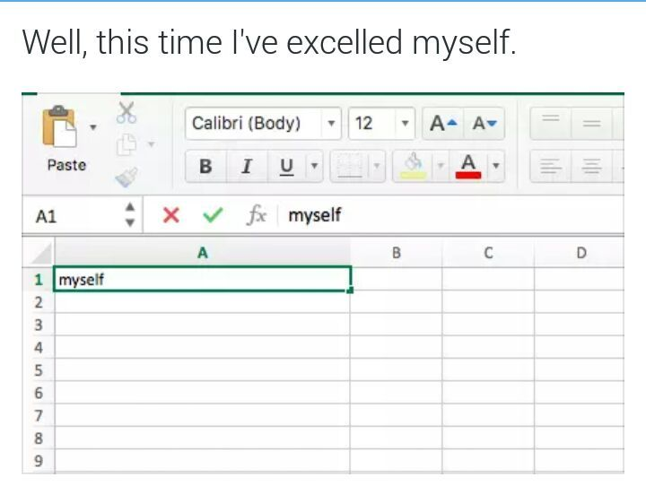

---

# What will I get from this workshop

---

::: {.incremental}
- Create a small application with spreadsheets for a simple calendar.
- Use Python for the columns
- Add some formulas, with Python!
- Create more than one ~~sheet~~, table!
- Go beyond the UI into API access and MCP

<!-- have full contorl over youd data ? -->
:::

::: {.notes}


:::

---

# Grist

---

## A relational spreadsheet

::: {.fragment}

- Grist is a modern relational spreadsheet. It combines the flexibility of a spreadsheet with the robustness of a database.

  It can run:
    - locally (docker or desktop)
    - in the cloud or homelab
    - like Google Docs at [https://getgrist.com](https://getgrist.com){target=_blank}
:::

::: {.fragment}
- It stores everything as a SQLite database that is easy to share and backup
:::

::: {.notes}

Talk about the SMVE (check if time allows)

:::

---

## Grist Architecture

```{mermaid}
%%{init: {
  "theme": "base",
  "flowchart": {"curve": "linear", "htmlLabels": true, "nodeSpacing": 40, "rankSpacing": 40, "diagramPadding": 6},
  "themeVariables": {
    "background": "#fdf6e3",
    "primaryColor": "#e4f1f8",
    "primaryTextColor": "#263238",
    "primaryBorderColor": "#24557a",
    "lineColor": "#607d8b",
    "clusterBkg": "#f8f1df",
    "clusterBorder": "#9aadaf",
    "fontFamily": "system-ui, sans-serif",
    "fontSize": "25px"
  }
}}%%
flowchart TB
    subgraph TopRow[" "]
        direction LR
        UI["Spreadsheet UI"]
        OfficialMCP["Official MCP"]
    end

    UI --> Engine["Document engine<br/>(Node.js)"]
    OfficialMCP <-.-> Engine
    Engine <--> DB[("SQLite")]
    Engine --> Sandbox["🐍 Sandboxed Python"] --> Formulas["Formulas"]
    Formulas --> Engine
    Engine <--> API["Grist REST API"]

    API <--> Notebook["Python notebook"]
    API <--> CLI["$ gry CLI"]
    API <--> MCP["With MCP"]

    classDef ui fill:#e4f1f8,stroke:#24557a,color:#263238,stroke-width:2px,font-size:25px;
    classDef python fill:#fff0c9,stroke:#8b4b00,color:#263238,stroke-width:2px,font-size:25px;
    classDef data fill:#edf3df,stroke:#5f6f36,color:#263238,stroke-width:2px,font-size:25px;
    classDef client fill:#dfeecf,stroke:#5f6f36,color:#263238,stroke-width:2px,font-size:25px;
    classDef terminal fill:#263238,stroke:#24557a,color:#fdf6e3,stroke-width:2px,font-family:monospace,font-size:25px;
    classDef mcp fill:#fdf6e3,stroke:#5f6f36,color:#263238,stroke-width:2px, font-size:25px;
    class UI,Engine,API,OfficialMCP ui;
    class Sandbox,Formulas python;
    class Notebook client;
    class Gry terminal;
    class DB data;
    class MCP mcp;
    style TopRow fill:none,stroke:none;
    linkStyle default stroke:#607d8b,stroke-width:2px;
```

## UI Structure

Working in Grist is organized in this way:

::: {.incremental}
-  A site (each user has his/hers)
  -  A workspace, this is like folders and contain documents
    -  Documents
      -  Database
      -  Pages, views and other presentation data

:::


<!-- Source: https://www.youtube.com/watch?v=X7BnmstKnAQ  -->

## The welcome screen

{.r-stretch}

---

## Creating a calendar style application

 For this we will create a few columns in a table

::: {.incremental}
- Activity
-  Start
-  End
-  All day
-  Category
:::

---

## First Table

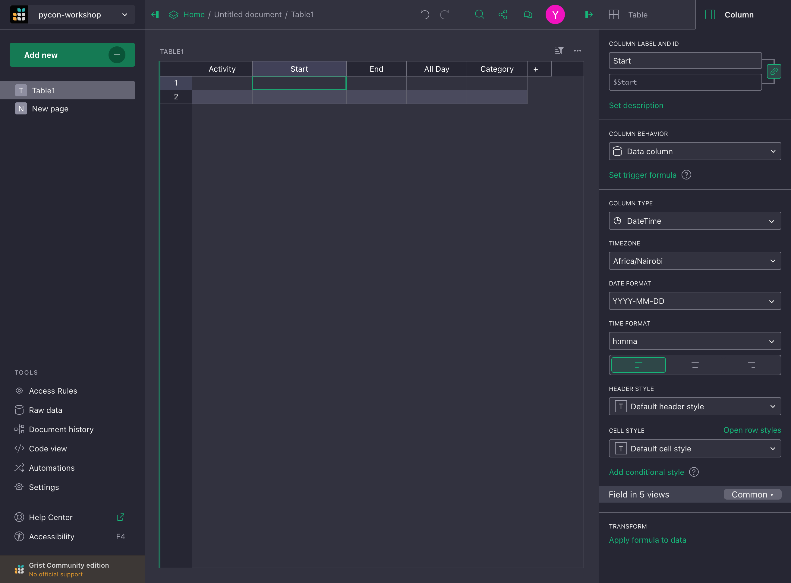{.r-stretch}

---

## Code View

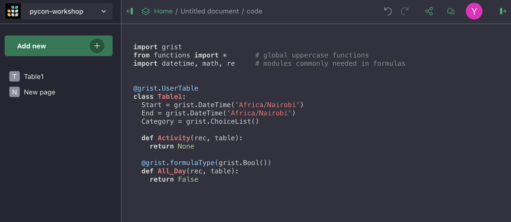

---

## First Python formula {.smaller}

::: {.fragment .bigger }
Let's create a our first formula to compute how many days we have before the column `$Start`
:::


::: {.fragment}
::: {.columns}
::: {.column}
```{.python}
$Start - TODAY()
```
:::
::: {.column}
`
datetime.timedelta(days=-3, seconds=45245, microseconds=577301)
`
:::
:::
::: {.fragment}
::: {.columns}
::: {.column}
```{.python}
from datetime import timedelta as td
return (
  $Start - NOW()
) / td(days=1)
```
:::
::: {.column}
`2.458484637708333`
:::
:::
:::
:::

::: {.fragment}
::: {.columns}
::: {.column}
```{.python}
from datetime import timedelta as td
return int(
  $Start - NOW()
) / td(days=1)
```
:::
::: {.column}
`2`
:::
:::
:::


::: {.fragment}
::: {.columns}
::: {.column}
```python
DATEDIF($Start, NOW(), 'D')
```
:::
::: {.column}
`3`
:::
:::
:::

---

## Adding a second table

Let's use a second ~~sheet~~ table, and ~~link~~ have a Foreign Key to our main table.


::: {.columns}
::: {.column width=30%}
::: {.fragment}
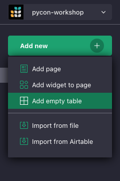
:::
:::
::: {.column width=70%}
::: {.fragment}
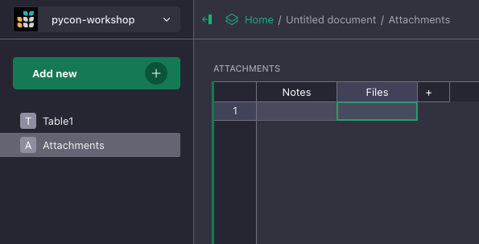
:::
:::
:::


---

## Setting up some column types


::: {.columns}

::: {.column}

**Markdown**

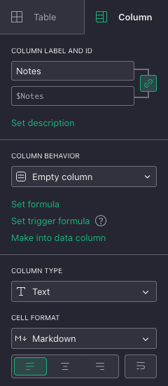
:::

::: {.column}

**Attachments**

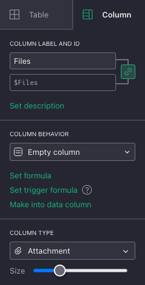

:::

:::


---

## Adding a reference column


::: {.columns}

::: {.column}

::: {.fragment}


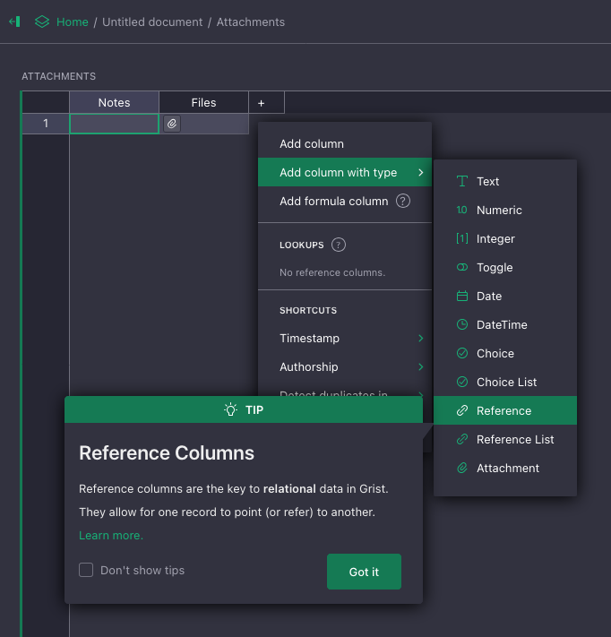

:::


:::

::: {.column}


::: {.fragment}


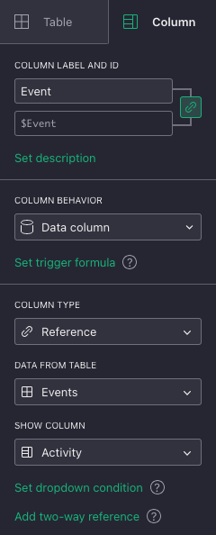

:::


:::

:::


---

## And lookups


::: {.fragment}


Let's look for the Attachments from the events table in a formula in events.

```
Attachments.lookupRecords(Event=$id)
```

:::


::: {.fragment}

Playing with the string repetitions
```python
count = len(Attachments.lookupRecords(Event=$id))

return "📦" * count
```

:::


---

## Putting together views

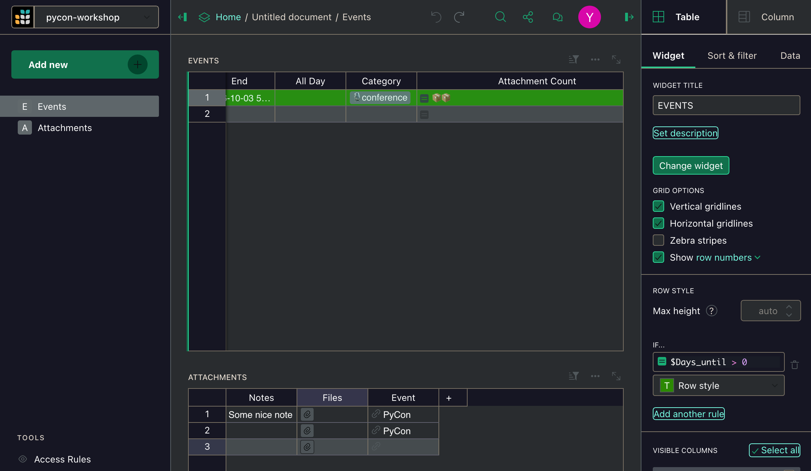{class=fofo}

---

## Computed / Helper Columns can be hidden 🙈


::: {.columns}

::: {.column}

From the author panel (right side on the `Table` tab, on the bottom)


:::

::: {.column}

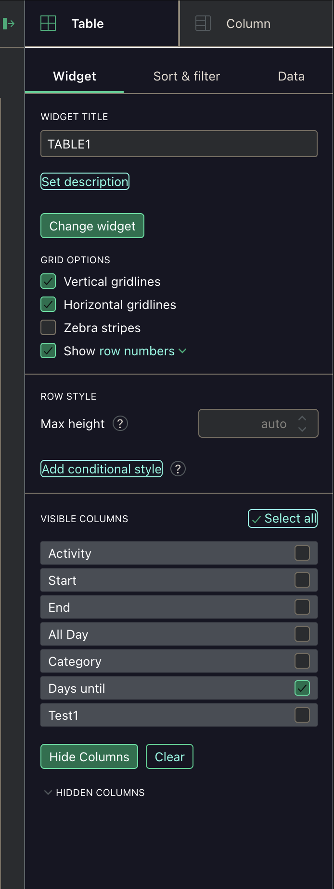

:::


:::


---

## Styling columns


::: {.columns}


::: {.column width=30%}

::: {.fragment}
#### Column styling

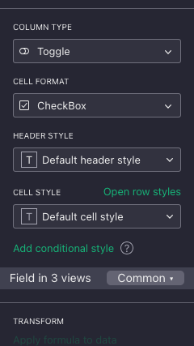
:::

:::

::: {.column width=30%}


::: {.fragment}
#### Row styling

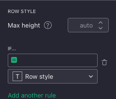

:::

:::

::: {.column width=30%}

::: {.fragment}
#### Creating a formula

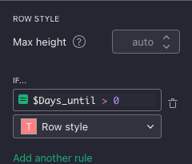
:::
:::
:::


---

## Custom Widgets {.smaller}

Grist supports custom widgets, an example of one that comes with
it is the calendar


::: {.columns}

::: {.column}

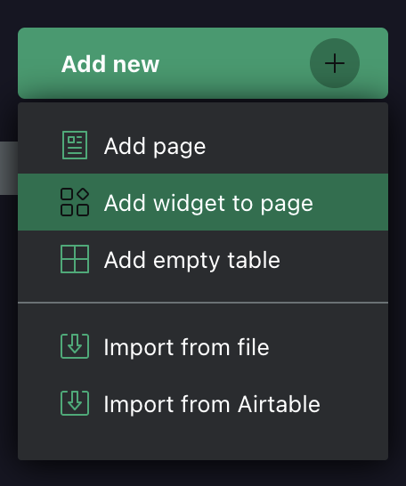


:::

::: {.column}

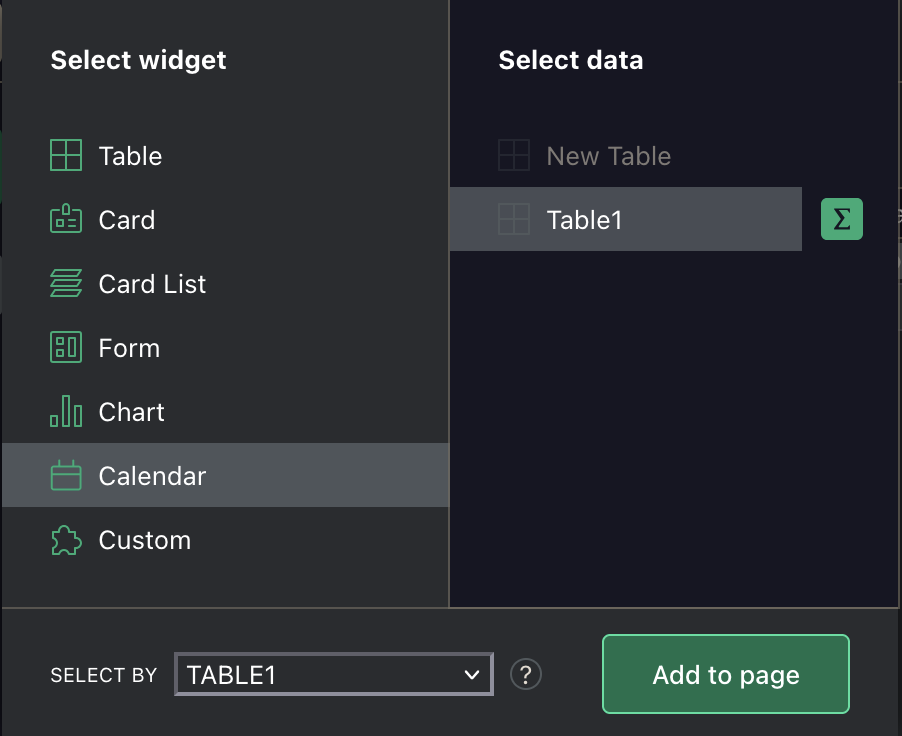


:::

:::

---

## Custom Widgets (cont.)


::: {.columns}

::: {.column}

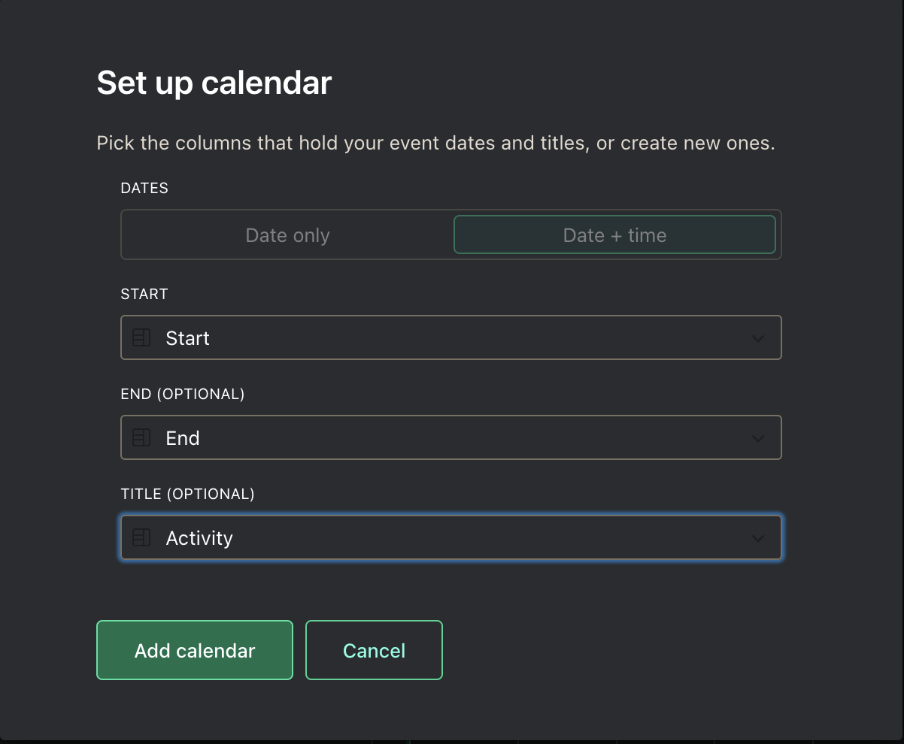

:::

::: {.column .smaller}

This configuration can be modified later in the creator panel.

:::

:::

---

## Custom Widgets (cont.)

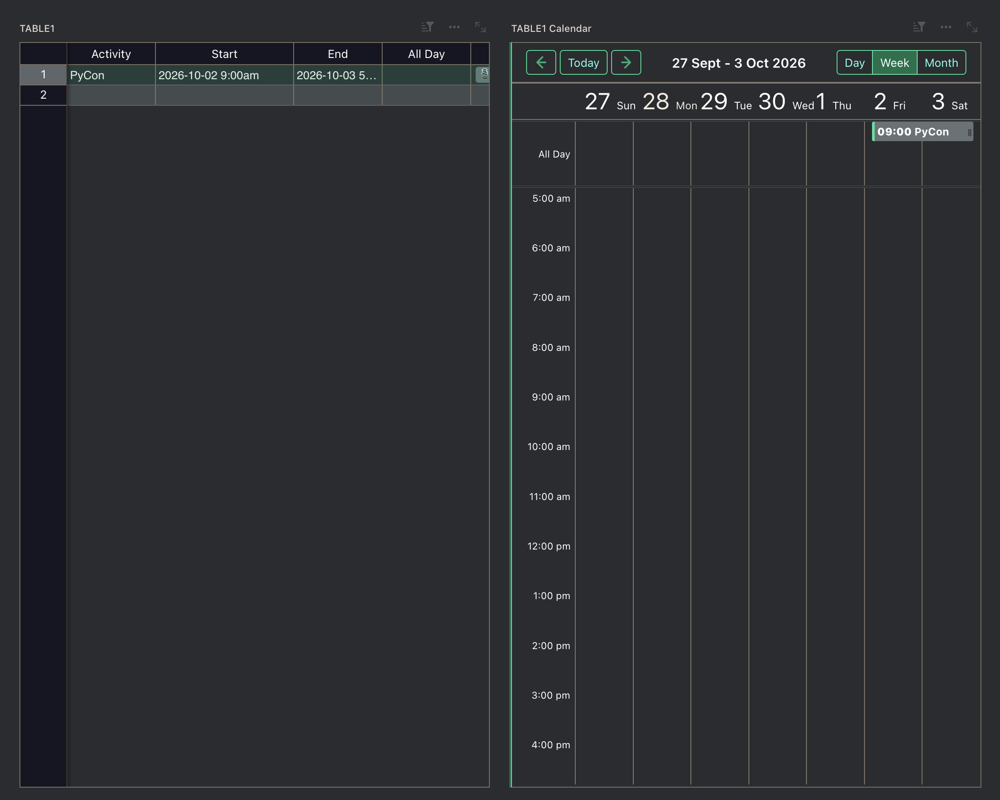{.r-stretch}

---

## More widgets to explore (or create)

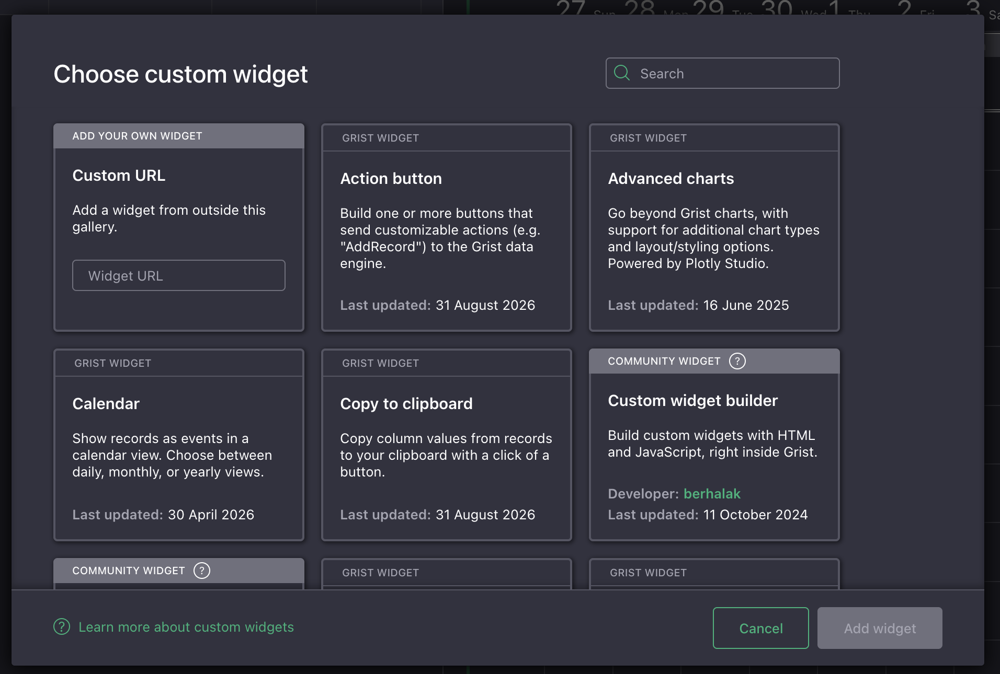{.r-stretch}

---

<!--

## Column types

::: {.columns}
::: {.column}

:::
::: {.column}

:::
:::

## Trying out dates

::: {.columns}
::: {.column}

:::
::: {.column}

:::
:::

-->

<!-- TODO: Examples from https://support.getgrist.com/examples/ -->

# Accessing your data over the API

---

## Getting the account's API key

To get the user's API key, this is in the [user settings](http://localhost:8484/account/developer){target=_blank}.

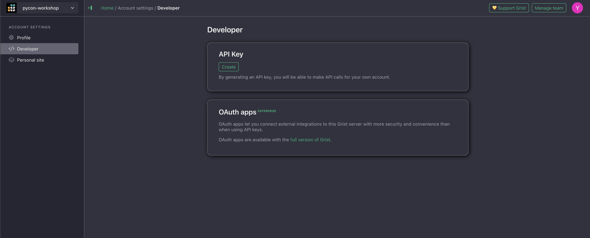

---

<!-- API access screenshots -->

::: {.columns}

::: {.column}

::: {.fragment}

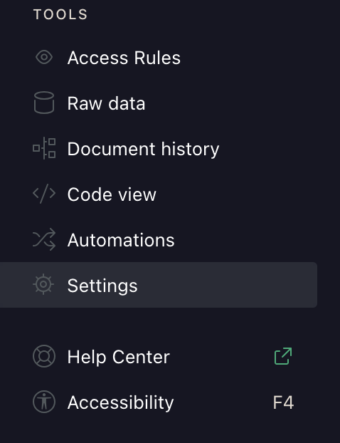{.fofu}

:::

:::

::: {.column}
::: {.fragment}
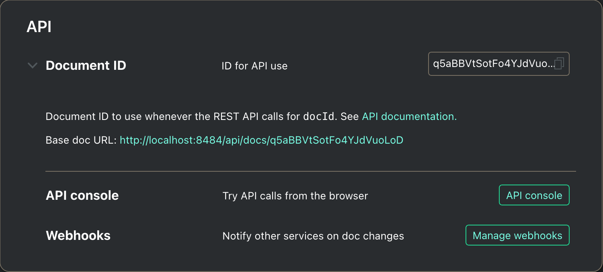
:::
::: {.fragment}
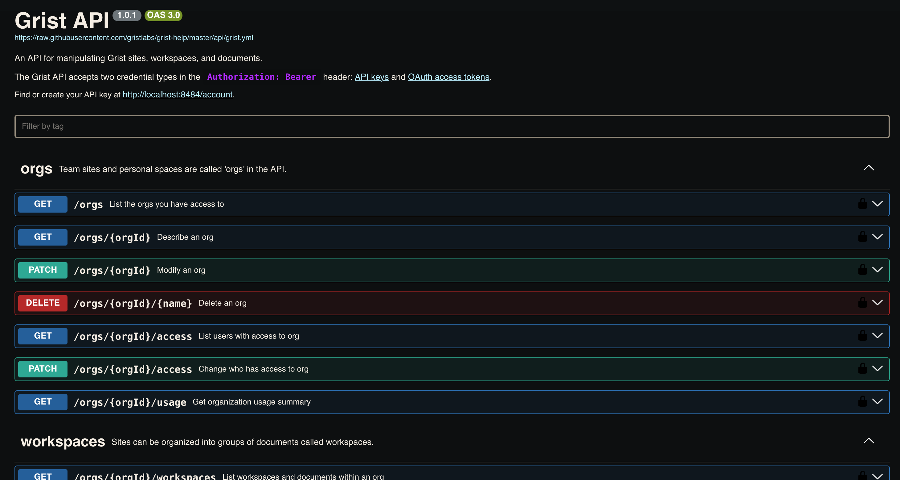
:::
:::

:::

---

## A CLI client for the API

`pygrister` is a Python library and a CLI for grist.

It requires an URL and an API key, but more configuration can be passed.

This in example `.env` we could use in our workshop repo:

```shell
GRIST_API_KEY=22...36
GRIST_SELF_MANAGED=Y
GRIST_SELF_MANAGED_HOME=http://localhost:8484
GRIST_SELF_MANAGED_SINGLE_ORG=N
GRIST_SERVER_PROTOCOL=http
GRIST_TEAM_SITE=docs
```

---

## gry - listing workspaces


::: {.fragment}


```
$ gry ws list
┏━━━━┳━━━━━━┳━━━━━━━┳━━━━━━━┳━━━━━━┓
┃ id ┃ name ┃ owner ┃ email ┃ docs ┃
┡━━━━╇━━━━━━╇━━━━━━━╇━━━━━━━╇━━━━━━┩
│ 3  │ Home │ Null  │       │ 1    │
└────┴──────┴───────┴───────┴──────┘
```
:::


::: {.fragment}


```
$ gry ws see -w 3
┏━━━━━━┳━━━━━━━━━━━━━━━━━━━━━━━━━━━━━━━━━━━━━━━━━━━━┓
┃ key  ┃ value                                      ┃
┡━━━━━━╇━━━━━━━━━━━━━━━━━━━━━━━━━━━━━━━━━━━━━━━━━━━━┩
│ id   │ 3                                          │
│ name │ Home                                       │
│ team │ 3 - pycon-workshop                         │
├──────┼────────────────────────────────────────────┤
│ doc  │ q5aBBVtSotFo4YJdVuoLoD - Untitled document │
└──────┴────────────────────────────────────────────┘
```

:::

---

## gry - listing tables

```
gry table list -d q5aBBVtSotFo
┏━━━━━━━━━━━━━┳━━━━━━━━━━━━━━━━━━━━━━━━━━━━━┓
┃ table id    ┃ metadata                    ┃
┡━━━━━━━━━━━━━╇━━━━━━━━━━━━━━━━━━━━━━━━━━━━━┩
│ Events      │ tableRef: 1                 │
│             │ primaryViewId: 1            │
│             │ summarySourceTable: 0       │
│             │ onDemand: False             │
│             │ rawViewSectionRef: 2        │
│             │ recordCardViewSectionRef: 3 │
├─────────────┼─────────────────────────────┤
│ Attachments │ tableRef: 2                 │
│             │ primaryViewId: 2            │
│             │ summarySourceTable: 0       │
│             │ onDemand: False             │
│             │ rawViewSectionRef: 5        │
│             │ recordCardViewSectionRef: 6 │
└─────────────┴─────────────────────────────┘
```

---

## gry - running SQL

```
gry sql 'select id, Activity, Start, Category from Events' -d q5aBBVtSotFo
┏━━━━┳━━━━━━━━━━┳━━━━━━━━━━━━┳━━━━━━━━━━━━━━━━━━┓
┃ id ┃ Activity ┃ Start      ┃ Category         ┃
┡━━━━╇━━━━━━━━━━╇━━━━━━━━━━━━╇━━━━━━━━━━━━━━━━━━┩
│ 2  │ PyCon    │ 1790920800 │ ["🎙️conference"] │
└────┴──────────┴────────────┴──────────────────┘
```

---

## Service Accounts

::: {.incremental}

- It's a bit dangerous to give full access to our documents to any automation with the user API key (GRIST_API_KEY)
- Service Accounts are pseudo-users which can be given finer grained access to a a few tables
- There's not UI for creating service accounts, but `gry` CLI comes handy.
:::

---

## Creating service accounts


---

## Inviting the service account to the document


---

## Using it with gry


---

## What about a notebook/script

---

<!-- Show `gry` -->

---


# Using grist MCP
🤖

---

## Connecting through MCP

<!-- MCP server options, official, Python and JavaScript one -->

[`mcp-server-grist`](https://github.com/nic01asFr/mcp-server-grist){target=blank_} is a MCP server written in Python. It allows AI applications like Claude, IBM Bob, Codex, pi, OpenClaw, Hermes, etc. to connect to the Grist API.

This is not as powerful as


---

## Using Hermes

---

# Closing words

---

::: {.incremental}
- The level of control
:::
