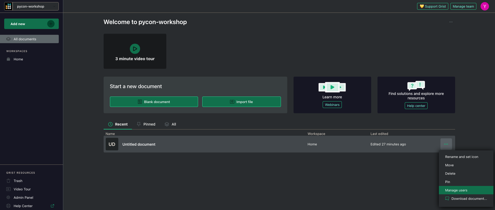
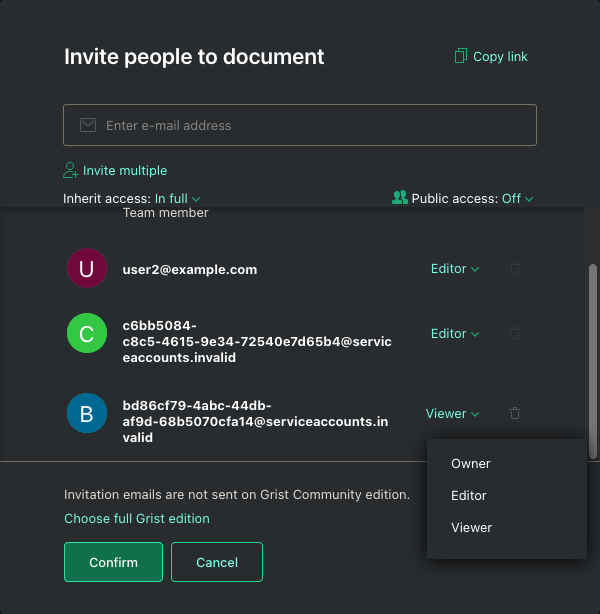
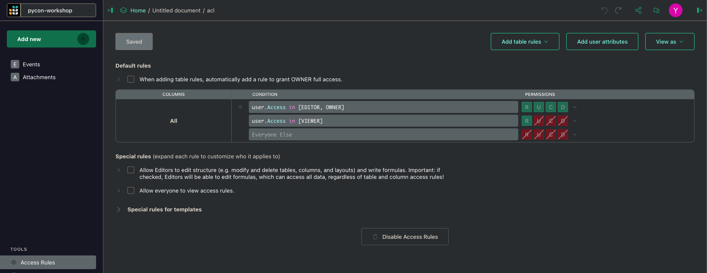
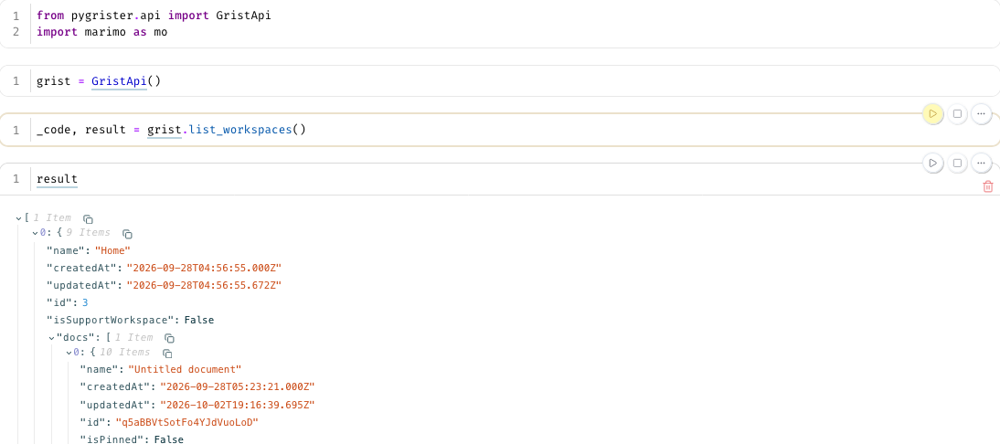
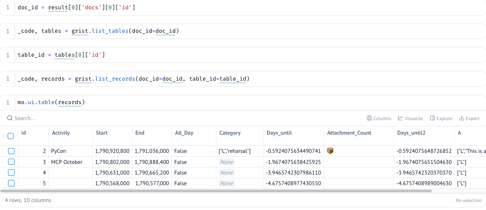
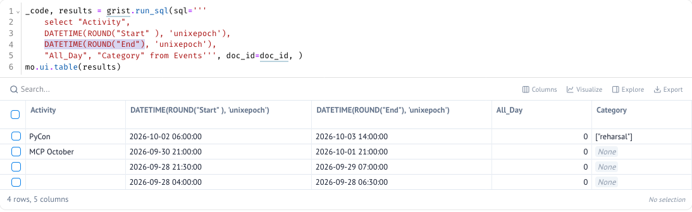
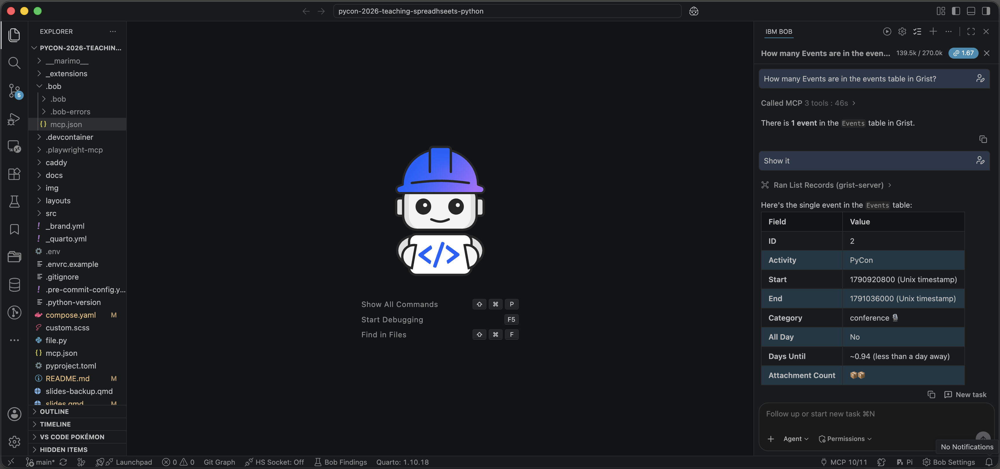
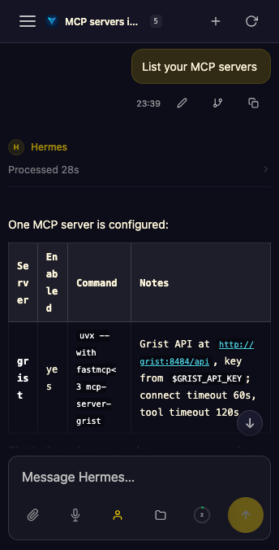
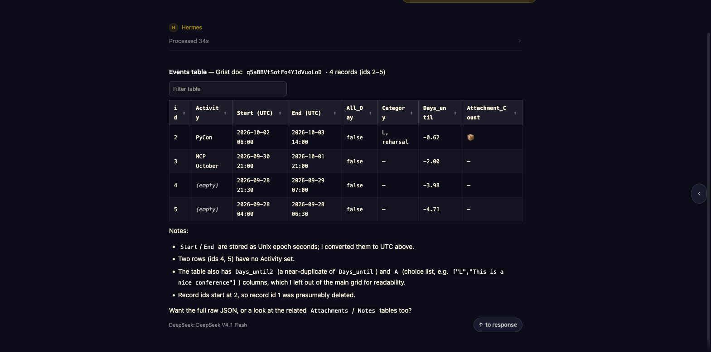

---

## About me {.about-me}

::: {.columns}

::: {.column width="60%"}

::: {.incremental}
- 🐍 Pythonista with 18 years of experience 🇦🇷 🧉
  - Co-organized SciPy Latin America
  - PyCon Argentina and EuroPython speaker
- 🚜 Former CTO at [Hello Tractor](https://hellotractor.com/)
- 🧪 Software Engineer at IBM Software Innovation Lab
- 🛰️ Worked on [foundational models for geospatial applications](https://www.earthdata.nasa.gov/news/nasa-ibm-openly-release-geospatial-ai-foundation-model-nasa-earth-observation-data)
- 💬 Worked on [Flowpilot](https://research.ibm.com/projects/flowpilot), providing core features to different products and divisions
- 💬 Currently working on [Datascape], a data harness for insight generation, enterprise data scale.
:::

:::

::: {.column width="40%"}

{.nolightbox .no-shadow fig-alt="A cartoon Python writing a spreadsheet formula with a fountain pen"}

:::

:::


---

## Motivation

<!-- ::: {.incremental}
- Build a small Calendar application based on spreadsheets
- Define tables and their relationships
- Customizing how they present information
- Use Python (and Excel functions) in formulas
- Accessing data over the API with different levels of access
- Accessing data over the CLI
- Interacting with the database through MCP in an Agent
-->

::: {.incremental}
- In recent times, owning your data has become more and more relevant.
- Many people use web-based spreadsheets as an important part of their lives.
- Python is one of the most popular programming languages, but using
  it in spreadsheets hasn't been really viable yet.
- Creating very bespoke or 'hyperpersonalized' software can be done
  both for personal use and for multi-user environments.
:::

---

## Agenda {.agenda .smaller}


::: {.timeline .vertical }
::: {.event data-label="Material" .tl-filled}
**Running the workshop**
Access to the slides, repo, and instructions on how to run the code.
:::
::: {.event data-label="Spreadsheet"}
**Grist**
Tables, Column Types, Python and Excel functions in formulas.
:::
::: {.event data-label="CLI Access"}
**pygrister**
CLI access using `gry` CLI.
:::
::: {.event data-label="Python library"}
**pygrister**
Pygrister API from Python
:::

::: {.event data-label="AI "}
**mcp-server-grist**
Accessing Grist API with AI tools
:::

::: {.event data-label="Questions"}
:::


:::

---

<!--
# Material

::: {.timeline .progress-timeline .tl-compact}
::: {.event data-label="Material" .tl-filled}
:::
::: {.event data-label="Spreadsheet"}
:::
::: {.event data-label="CLI Access"}
:::
::: {.event data-label="Python library"}
:::
::: {.event data-label="AI"}
:::
::: {.event data-label="Questions"}
:::
:::

---
-->

## Slide & Code
<!-- Add links and QR codes for the slides, repository, and workshop materials. -->

::: {.columns .follow-along-columns}
::: {.column .follow-along-qr}

[](https://d3f0.github.io/py-spreadsheets-2026/slides.html#/title-slide){target="_blank"}

[https://d3f0.github.io/py-spreadsheets-2026/slides.html](https://d3f0.github.io/py-spreadsheets-2026/slides.html){target="_blank"}

:::
::: {.column}
**👈🏽 Slides**

**👇🏽 🐳 & ** [{.inline-icon .nolightbox width=32 style="vertical-align: text-bottom;"}](https://docs.tilt.dev/install.html){target="_blank"} **run the workshop**

```{.shell code-line-numbers="false"}
gh repo clone \
  D3f0/py-spreadsheets-2026 \
  && uv run tasks.py up
```


:::
:::

---


{target=_blank}](./img/tilt.png)


---

## Before you try the repo code

::: {.incremental  }

- 🐳 `docker` and its `docker compose` plugin are required to run the demo material
- 🐍 Python tools/CLI/etc. should run with `uv run` or, more permanently, `uv tool install <name>`.
- 🛶 You don't need `tilt` if you don't want the fancy webpage with hot reload, just
  use `docker compose up` and look at the ports.
- 🤖 For the AI examples, I've used OpenRouter, but you can use any AI provider
  you'd like.
:::

---

# Grist


::: {.timeline .progress-timeline .tl-compact}
::: {.event data-label="Material"}
:::
::: {.event data-label="Spreadsheet" .tl-filled}
:::
::: {.event data-label="CLI Access"}
:::
::: {.event data-label="Python library"}
:::
::: {.event data-label="AI"}
:::
::: {.event data-label="Questions"}
:::
:::

---

## What is grist?

::: {.fragment}

- Grist is a modern relational spreadsheet. It combines the flexibility of a spreadsheet with the robustness of a database.

  It can run:
    - locally (docker or desktop)
    - in the cloud or homelab
    - like Google Docs at [https://getgrist.com](https://getgrist.com){target=_blank}
:::

::: {.fragment}
- It stores everything as a SQLite database that is easy to share and backup
:::

::: {.notes}

Talk about the SMVE (check if time allows)

:::

---

## Example library


{target=_blank}](./img/grist-templates.png)


---

## Grist Architecture

```{mermaid}
%%{init: {
  "theme": "base",
  "flowchart": {"curve": "linear", "htmlLabels": true, "nodeSpacing": 40, "rankSpacing": 40, "diagramPadding": 6},
  "themeVariables": {
    "background": "#fdf6e3",
    "primaryColor": "#e4f1f8",
    "primaryTextColor": "#263238",
    "primaryBorderColor": "#24557a",
    "lineColor": "#607d8b",
    "clusterBkg": "#f8f1df",
    "clusterBorder": "#9aadaf",
    "fontFamily": "system-ui, sans-serif",
    "fontSize": "25px"
  }
}}%%
flowchart TB
    subgraph TopRow[" "]
        direction LR
        UI["Spreadsheet UI 👈🏽"]
        OfficialMCP["Official MCP"]
        Webhooks
    end

    UI --> Engine["Document engine<br/>(Node.js)"]
    OfficialMCP <-.-> Engine
    Engine <--> DB[("SQLite")]
    Engine --> Sandbox["🐍 Sandboxed Python"] --> Formulas["Formulas"]
    Formulas --> Engine
    Engine <--> API["Grist REST API"]

    API <--> CLI["gry (cli) 👈🏽"]
    API <--> Notebook["Python notebook 👈🏽"]
    API <--> MCP["OSS MCP 👈🏽"]

    classDef grist fill:#e4f1f8,stroke:#24557a,color:#263238,stroke-width:2px,font-size:25px;
    classDef python fill:#fff0c9,stroke:#8b4b00,color:#263238,stroke-width:2px,font-size:25px;
    classDef data fill:#edf3df,stroke:#5f6f36,color:#263238,stroke-width:2px,font-size:25px;
    classDef client fill:#dfeecf,stroke:#5f6f36,color:#263238,stroke-width:2px,font-size:25px;
    classDef terminal fill:#263238,stroke:#24557a,color:#fdf6e3,stroke-width:2px,font-family:monospace,font-size:25px;
    classDef mcp fill:#fdf6e3,stroke:#5f6f36,color:#263238,stroke-width:2px, font-size:25px;
    class UI,Engine,API,OfficialMCP,Webhooks grist;
    class Sandbox,Formulas python;
    class Notebook client;
    class CLI client;
    class DB data;
    class MCP client;
    style TopRow fill:none,stroke:none;
    linkStyle default stroke:#607d8b,stroke-width:2px;
```

## UI Structure

The UI is organized around a tree/breadcrumb structure:

::: {.incremental}
-  A site (each user has their own)
  -  A workspace, which is like a folder that contains documents
    -  Documents
      -  Database
      -  Pages (tabs), views, widgets, 🐍 formulas

:::


<!-- Source: https://www.youtube.com/watch?v=X7BnmstKnAQ  -->

## The workspace view

{.r-stretch}

---

## Creating a calendar-style application

 For this we will create a few columns in a table

::: {.incremental}
- Activity
-  Start
-  End
-  All day
-  Category
:::

---

## First Table

{.r-stretch}

---

## Code View


---

## Writing Python formula {.smaller}

::: {.fragment .bigger }
Let's create our first formula to compute how many days we have before the `$Start` column.
:::


::: {.fragment}
::: {.columns}
::: {.column}
```{.python}
$Start - NOW()
```
:::
::: {.column}
`
datetime.timedelta(days=-3, seconds=45245, microseconds=577301)
`
:::
:::
::: {.fragment}
::: {.columns}
::: {.column}
```{.python}
from datetime import timedelta
return (
  $Start - NOW()
) / timedelta(days=1)
```
:::
::: {.column}
`2.458484637708333`
:::
:::
:::
:::

::: {.fragment}
::: {.columns}
::: {.column}
```{.python}
from datetime import timedelta
return int(
  $Start - NOW()
) / timedelta(days=1)
```
:::
::: {.column}
`2`
:::
:::
:::


::: {.fragment}
::: {.columns}
::: {.column}
```python
DATEDIF($Start, NOW(), 'D')
```
:::
::: {.column}
`3`
:::
:::
:::

---

## Adding a second table

Let's use a second ~~sheet~~ table and ~~link~~ it with a foreign key to our main table.


::: {.columns}
::: {.column width=30%}
::: {.fragment}

:::
:::
::: {.column width=70%}
::: {.fragment}

:::
:::
:::


---

## Setting up some column types


::: {.columns}

::: {.column}

**Markdown**


:::

::: {.column}

**Attachments**


:::

:::


---

## Adding a reference column


::: {.columns}

::: {.column}

::: {.fragment}


:::


:::

::: {.column}


::: {.fragment}


:::


:::

:::


---

## And lookups


::: {.fragment}


 Events   Attachments

```
Attachments.lookupRecords(Event=$id)
```

:::


::: {.fragment}

Playing with string repetition
```python
count = len(Attachments.lookupRecords(Event=$id))

return "📦" * count
```

:::


---

## Putting together views

{class=fofo}

---

<!--
## Computed / Helper Columns can be hidden 🙈


::: {.columns}

::: {.column}

From the author panel (right side on the `Table` tab, on the bottom)


:::

::: {.column}


:::


:::


---

## Styling columns


::: {.columns}
::: {.column width=30%}
::: {.fragment}
#### Column styling


:::
:::

::: {.column width=30%}
::: {.fragment}
#### Row styling


:::

:::

::: {.column width=30%}

::: {.fragment}
#### Creating a formula


:::
:::
:::

-->


## Presentation

::: {.smaller}

Grist supports a diverse range of widgets. We will focus on a simple one
called the Calendar widget .


::: {.columns}

::: {.column}

{}


:::

::: {.column}


:::

:::

:::

::: notes
Visualizations are done also through widgets
:::

---

## Calendar Widgets (cont.)


::: {.columns}

::: {.column}


:::

::: {.column .smaller}

This configuration can be modified later in the creator panel.

:::

:::

---

## Calendar Widgets (cont.)

::: {.columns}
::: {.column width=70%}
{.r-stretch}
:::

::: {.column width=30%}

  

The *binding* is bidirectional, meaning that creating an event in
the calendar will automatically be reflected in the original table.

:::
:::

---

## More widgets to explore

{.r-stretch}

---

## Custom widgets

- Custom CSS, HTML, and JS can be stored in Grist itself.
- If they are meant to be re-used in many documents, it's recommended to
  host these resources in a common place.
- A coding AI agent/harness with good planning can create engaging UIs

---

<!--

## Column types

::: {.columns}
::: {.column}

:::
::: {.column}

:::
:::

## Trying out dates

::: {.columns}
::: {.column}

:::
::: {.column}

:::
:::

-->

<!-- TODO: Examples from https://support.getgrist.com/examples/ -->

# API Access

::: {.timeline .progress-timeline .tl-compact}
::: {.event data-label="Material"}
:::
::: {.event data-label="Spreadsheet"}
:::
::: {.event data-label="CLI Access" .tl-filled}
:::
::: {.event data-label="Python library"}
:::
::: {.event data-label="AI"}
:::
::: {.event data-label="Questions"}
:::
:::

---

## Getting the account's API key

To get the user's API key, you can find it in the [user settings](http://localhost:8484/account/developer){target=_blank}.


---

## The document identifier

::: {.columns}

::: {.column}

::: {.fragment}

{.fofu}

:::

:::

::: {.column}
::: {.fragment}

:::
::: {.fragment}

:::
:::

:::

---

## A CLI client for the API

`pygrister` is a Python library and a CLI for grist [^1]

It requires a URL and an API key, but additional configuration can be passed.

In this example, `.env`[^2] is the file we could use in our workshop repo:

```shell
GRIST_API_KEY=<your user api key>
GRIST_SELF_MANAGED=Y
GRIST_SELF_MANAGED_HOME=http://localhost:8484
GRIST_SELF_MANAGED_SINGLE_ORG=N
GRIST_SERVER_PROTOCOL=http
GRIST_TEAM_SITE=docs
```

[^1]: If you cloned the repo, it will be available with `uv run` (or `uvx --from pygrister gry`).
[^2]: This file needs to be created as the demo data lives in docker volumes

---

## gry - listing workspaces

::: {.fragment}

```
$ gry ws list
┏━━━━┳━━━━━━┳━━━━━━━┳━━━━━━━┳━━━━━━┓
┃ id ┃ name ┃ owner ┃ email ┃ docs ┃
┡━━━━╇━━━━━━╇━━━━━━━╇━━━━━━━╇━━━━━━┩
│ 3  │ Home │ Null  │       │ 1    │
└────┴──────┴───────┴───────┴──────┘
```
:::


::: {.fragment}

```
$ gry ws see -w 3
┏━━━━━━┳━━━━━━━━━━━━━━━━━━━━━━━━━━━━━━━━━━━━━━━━━━━━┓
┃ key  ┃ value                                      ┃
┡━━━━━━╇━━━━━━━━━━━━━━━━━━━━━━━━━━━━━━━━━━━━━━━━━━━━┩
│ id   │ 3                                          │
│ name │ Home                                       │
│ team │ 3 - pycon-workshop                         │
├──────┼────────────────────────────────────────────┤
│ doc  │ q5aBBVtSotFo4YJdVuoLoD - Untitled document │
└──────┴────────────────────────────────────────────┘
```

:::

---

## gry - listing tables

::: {.service-account-output}
```
gry table list -d q5aBBVtSotFo
┏━━━━━━━━━━━━━┳━━━━━━━━━━━━━━━━━━━━━━━━━━━━━┓
┃ table id    ┃ metadata                    ┃
┡━━━━━━━━━━━━━╇━━━━━━━━━━━━━━━━━━━━━━━━━━━━━┩
│ Events      │ tableRef: 1                 │
│             │ primaryViewId: 1            │
│             │ summarySourceTable: 0       │
│             │ onDemand: False             │
│             │ rawViewSectionRef: 2        │
│             │ recordCardViewSectionRef: 3 │
├─────────────┼─────────────────────────────┤
│ Attachments │ tableRef: 2                 │
│             │ primaryViewId: 2            │
│             │ summarySourceTable: 0       │
│             │ onDemand: False             │
│             │ rawViewSectionRef: 5        │
│             │ recordCardViewSectionRef: 6 │
└─────────────┴─────────────────────────────┘
```
:::

---

## gry - running SQL

```
gry sql \
    'select id, Activity, Start, Category from Events' \
    -d q5aBBVtSotFo

┏━━━━┳━━━━━━━━━━┳━━━━━━━━━━━━┳━━━━━━━━━━━━━━━━━━┓
┃ id ┃ Activity ┃ Start      ┃ Category         ┃
┡━━━━╇━━━━━━━━━━╇━━━━━━━━━━━━╇━━━━━━━━━━━━━━━━━━┩
│ 2  │ PyCon    │ 1790920800 │ ["🎙️conference"] │
└────┴──────────┴────────────┴──────────────────┘
```

::: {.callout}
We also have JSON output if emojis are breaking the width calculation 🤭
:::
<!-- ---

## Service Accounts

::: {.incremental}

- It's a bit dangerous to give full access to our documents to any automation with the user API key (GRIST_API_KEY)
- Service Accounts are pseudo-users which can be given finer grained access to a a few tables
- There's not UI for creating service accounts, but `gry` CLI comes handy.
:::

---

## Creating service accounts

::: {.fragment }
```
gry sacc new --label sacc 2026-12-31
Done. Id: 2 (key: 6a4e9e39ceb0161bbbd5971089e215647191db97)
```
:::

::: {.fragment}
👆 that's the new API key for that service account, and should replace `GRIST_API_KEY`
:::

::: {.fragment .service-account-output}
```
gry sacc see 2
┏━━━━━━━━━━━━━┳━━━━━━━━━━━━━━━━━━━━━━━━━━━━━━━━━━━━━━━━━━━━━━━━━━━━━━━━━━━━━━┓
┃ key         ┃ value                                                        ┃
┡━━━━━━━━━━━━━╇━━━━━━━━━━━━━━━━━━━━━━━━━━━━━━━━━━━━━━━━━━━━━━━━━━━━━━━━━━━━━━┩
│ id          │ 2                                                            │
│ login       │ bd86cf79-4abc-44db-af9d-68b5070cfa14@serviceaccounts.invalid │
│ label       │ sacc                                                         │
│ description │                                                              │
│ expires     │ 2026-12-31T00:00:00.000Z                                     │
│ valid key   │ True                                                         │
└─────────────┴──────────────────────────────────────────────────────────────┘
```
:::

---

## Key has no access

```
GRIST_API_KEY=6a4e9e39ceb0161bbbd5971089e215647191db97 gry ws list
Error! Status: 403
{'error': 'access denied'}
```

---

## Inviting the service account to the document



---

## Using our service account




---

## Setting fine grained permissions



---

## Service account now has access

```
GRIST_API_KEY=6a4e9e39ceb0161bbbd5971089e215647191db97 gry ws list
┏━━━━┳━━━━━━┳━━━━━━━┳━━━━━━━┳━━━━━━┓
┃ id ┃ name ┃ owner ┃ email ┃ docs ┃
┡━━━━╇━━━━━━╇━━━━━━━╇━━━━━━━╇━━━━━━┩
│ 3  │ Home │ Null  │       │ 1    │
└────┴──────┴───────┴───────┴──────┘
``` -->

---

# Using directly from Python

::: {.timeline .progress-timeline .tl-compact}
::: {.event data-label="Material"}
:::
::: {.event data-label="Spreadsheet"}
:::
::: {.event data-label="CLI Access"}
:::
::: {.event data-label="Python library" .tl-filled}
:::
::: {.event data-label="AI"}
:::
::: {.event data-label="Questions"}
:::
:::

---

## Python API

::: {.incremental}
- We're going to use the second service from the stack, the `Marimo Notebook`
- To access Grist programmatically through `pygrister`, we use `pygrister.api.GristApi()`
- The `.env` is the same, but we can also look for other methods to provide the
  configuration.
- The API always responds with `status_code` and `data`
:::

---

## The list workspace method




---

### Listing records



---

### Running SQL Queries



::: {.callout}
All the functions use the SQLite dialect 
:::


---


# Using grist MCP
🤖

::: {.timeline .progress-timeline .tl-compact}
::: {.event data-label="Material"}
:::
::: {.event data-label="Spreadsheet"}
:::
::: {.event data-label="CLI Access"}
:::
::: {.event data-label="Python library"}
:::
::: {.event data-label="AI" .tl-filled}
:::
::: {.event data-label="Questions"}
:::
:::

---

## Model Context Protocol

<!-- MCP server options, official, Python and JavaScript one -->


::: {.fragment}
[`mcp-server-grist`](https://github.com/nic01asFr/mcp-server-grist){target=blank_} is an MCP server written in Python. It allows AI applications like Claude, IBM Bob, Codex, pi, OpenClaw, Hermes, etc. to connect to the Grist API.

::: callout
This is not the official MCP that lives in `https://<yoursite>.getgrist.com/mcp` for the
commercial version, so authentication will use the same API keys instead of OAuth2.
:::

:::


::: {.fragment}
To run `mcp-server-grist` with `uv` we need these two environment variables:

- `GRIST_API_KEY` (user or Service Account)
- `GRIST_API_URL` (this will be where Grist is running + `/api`)
:::

---

## Example JSON {.smaller}

```json
{
  "mcpServers": {
    "grist-server": {
      "timeout": 60,
      "type": "stdio",
      "command": "uvx",
      "args": [
        "--with",
        "fastmcp<3", # this is important 🙈 as it's not been updated
        "mcp-server-grist"
      ],
      "env": {
        "GRIST_API_KEY": "2273b28ebed8ba2aa38c99f788cf9cb314012536",
        "GRIST_API_URL": "http://localhost:8484/api"
      }

    }
  }
}

```

::: callout
👆 I'm going to use this in IBM Bob, but it should work the same way with any other harness
:::

---

## Example conversation



---

## Using Hermes

::: {.incremental}
- Hermes is a popular personal agent that comes with memory by default.
- Comes with some connectors/providers for some messaging platforms
    

- We will try this extension called [WebUI extension ]()
:::

---

## Hermes (cont)

::: {.columns}
::: {.column}

:::
::: {.column}
Listing our MCP tools after configuration.
:::
:::

---

## Hermes (cont)

When asked to query the same table, it reasons about the output.



---

## Safer use of AI

::: {.incremental}
- Hermes will learn over time, this is a helpful feature.
- LLMs can be *too smart* and try to achieve a goal in unintended ways, so
  using a Grist service account key instead of a user key can reduce the things
  it can break.
- Additionally, we can make different types of copies (templates, structure-only copies) to
  prevent Hermes from breaking things.
:::


---

<!-- Meme -->


---

# Thank you

---

# Questions

::: {.timeline .progress-timeline .tl-compact}
::: {.event data-label="Material"}
:::
::: {.event data-label="Spreadsheet"}
:::
::: {.event data-label="CLI Access"}
:::
::: {.event data-label="Python library"}
:::
::: {.event data-label="AI"}
:::
::: {.event data-label="Questions" .tl-filled}
:::
:::


---
